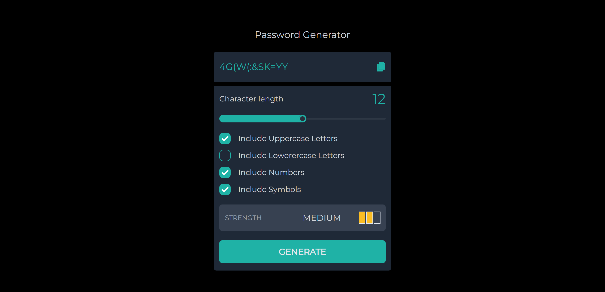

---

# Password Generator

#### Generate a completely random password by including different characters to the length of your choice.

#### Live demo: https://generate-pwd.vercel.app

---

## Description

This project is built with:

- [ReactJS](https://reactjs.org/)
- [Redux Toolkit](https://redux-toolkit.js.org/)
- [Tailwind CSS](https://tailwindcss.com/)
- [DaisyUI](https://daisyui.com/)
- [React Icons](https://react-icons.github.io/react-icons)
- [React Toastify](https://fkhadra.github.io/react-toastify/introduction)

## Getting started

To run the project locally make sure ``` NodeJS ``` is installed.

After you clone the repo
``` 
npm install
npm start
```
  
---
## Leave ⭐⭐⭐ if you find this interesting.

   
  
